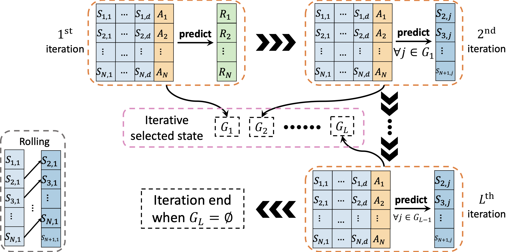

SEEK: Sequential Knockoffs for Variable Selection in Reinforcement Learning
---

This repository contains the implementation for the paper "Sequential Knockoffs for Variable Selection in Reinforcement Learning" (JASA, 2025+) in Python.

### Code for Simulation

- Tables 3-6: Run `simu.py`.
- Figure A1: Run `simu_select_alpha.py`.
- Tables A4-A5 and Figure A2: Run `simu.py`.
- `beta-mixing/K_consistency.R`: reproduce the consistency of $K$ selection algorithm

### Code for Real Data

Table 1: Run `RealData-MIMIC3.py` to reproduce the variable selection results. Then, run `offline_train_eval.py` to yield the off-policy evaluation results. 

Instruction for accessing the data:

- The data are available at: [https://physionet.org/content/mimiciii/1.4/](https://physionet.org/content/mimiciii/1.4/). Since it is a restricted-access resource, you must fulfill all of the following requirements to access it. The first step is registering to become a credentialed user. Secondly, complete the required CITI "Data or Specimens Only Research" training: [https://physionet.org/content/mimiciii/view-required-training/1.4/#1](https://physionet.org/content/mimiciii/view-required-training/1.4/#1). Thirdly, submit proof of your training completion. Finally, please sign the MIMIC-III [Data Use Agreement](https://physionet.org/sign-dua/mimiciii/1.4/). 

- After you get the accessibility on MIMIC-III v1.4, please leverage an open-source Github repo (i.e., [https://github.com/microsoft/mimic_sepsis](https://github.com/microsoft/mimic_sepsis)) to generating the sepsis cohort from MIMIC III dataset. Our reinforcement learning procedure are applied on the the sepsis cohort. Please read [README.md](https://github.com/microsoft/mimic_sepsis/blob/main/README.md) in the repo and follow the instructions to obtain a preprocessed cohort. 